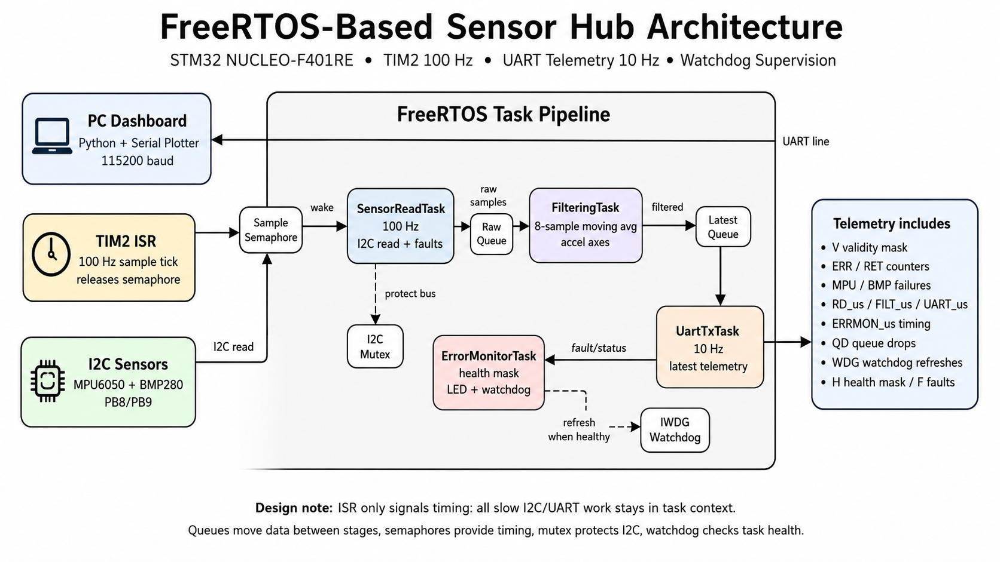

#RTOS-Based Sensor Hub

This is the next version of my STM32 sensor logger project. The first version proved that the NUCLEO-F401RE could sample an MPU6050 and BMP280, filter the accelerometer data, and stream UART telemetry. For this version, I wanted to make the design feel closer to a real embedded system by splitting the work into FreeRTOS tasks instead of keeping everything inside one foreground loop.

The main goal for me was to practice RTOS design patterns: tasks, queues, semaphores, mutexes, watchdog servicing, and task timing measurements. I kept the same hardware so the project builds directly on the original logger instead of becoming a completely separate idea.



## What I changed from the base logger

- Moved from a single-loop logger into a FreeRTOS task pipeline.
- Kept TIM2 as the 100 Hz timing source.
- Used a semaphore from the TIM2 interrupt to trigger sensor reads.
- Split the work into sensor read, filtering, UART transmit, and error monitor tasks.
- Added queues between the raw sensor stage and filtered output stage.
- Added an I2C mutex so only one task can touch the sensor bus at a time.
- Added watchdog refresh logic that depends on task health.
- Added task runtime measurements in microseconds using the DWT cycle counter.
- Kept the Python serial dashboard so I can actually see the system behavior live.

## Hardware

- Board: NUCLEO-F401RE / STM32F401RE
- IMU: MPU6050
- Pressure/temperature: BMP280
- I2C: I2C1 on PB8/PB9
- BMP280 address: auto-probes `0x76`, then `0x77`
- UART: USART2 through ST-LINK virtual COM port
- Timer: TIM2 at 100 Hz
- Watchdog: IWDG

## Wiring notes

| NUCLEO-F401RE | Signal | Sensor connection |
|---|---|---|
| 3.3V | Power | MPU6050 VCC, BMP280 VCC |
| GND | Ground | MPU6050 GND, BMP280 GND |
| PB8 | I2C1_SCL | MPU6050 SCL, BMP280 SCL |
| PB9 | I2C1_SDA | MPU6050 SDA, BMP280 SDA |
| USB ST-LINK | USART2 VCP | PC serial dashboard |

My note: keep the sensors at 3.3V. Most breakout boards already have I2C pull-ups, but if the bus acts weird, that is one of the first things I would check with a logic analyzer.

## RTOS task layout

### SensorReadTask

This task waits on a semaphore released by TIM2. TIM2 still runs at 100 Hz, but the interrupt does not do the I2C read directly. It only wakes the task. The task then reads the MPU6050 and BMP280 through the hardware layer.

What I wanted to show here:

- Interrupt-driven timing without doing slow I2C work inside the ISR.
- Sensor fault detection when either sensor disconnects.
- Retry/error counters when I2C communication fails.
- A mutex around I2C so the bus is protected if the project grows later.

### FilteringTask

This task consumes raw samples from a queue and applies an 8-sample moving average to the accelerometer axes.

My note: I only filter the accelerometer values right now because they are the easiest to show on the dashboard. The gyro and BMP280 values are passed through directly.

### UartTxTask

This task transmits telemetry at 10 Hz. It uses the latest filtered sample and sends integer-scaled values so the STM32 does not need expensive float formatting.

### ErrorMonitorTask

This task checks whether the critical tasks are still alive. If the sensor, filter, and UART tasks all reported activity in the last monitor window, the task refreshes the watchdog. If not, the watchdog is allowed to reset the board.

## Data flow

```text
TIM2 ISR @ 100 Hz
      |
      v
sample semaphore
      |
      v
SensorReadTask  --raw queue-->  FilteringTask  --latest queue-->  UartTxTask
      |                              |                              |
      |                              |                              v
      |                              |                         UART @ 10 Hz
      v                              v
Error counters                 Moving average
      |
      v
ErrorMonitorTask --> watchdog refresh / LED status
```

## Telemetry example

```text
TS:1234,V:3,AX_mg:10,AY_mg:-5,AZ_mg:1002,GX_cdps:0,GY_cdps:1,GZ_cdps:-2,T_cC:2450,P_chPa:101325,ERR:0,RET:0,MPUF:0,BMPF:0,RD_us:900,FILT_us:20,UART_us:2000,ERRMON_us:15,QD:0,WDG:5,H:7,F:0
```

Quick notes for myself:

- `V:3` means both sensors are valid.
- `V:1` means MPU6050 valid, BMP280 missing/failing.
- `V:2` means BMP280 valid, MPU6050 missing/failing.
- `RET` is the retry counter.
- `ERR` is the communication error counter.
- `RD_us`, `FILT_us`, `UART_us`, and `ERRMON_us` are task timing measurements.
- `QD` shows queue drops.
- `WDG` is watchdog refresh count.
- `H` is the latest task heartbeat mask.
- `F` is the fault flag mask.

More detail is in [`docs/telemetry_format.md`](docs/telemetry_format.md).

## CubeIDE / CubeMX setup

CubeIDE project for the NUCLEO-F401RE with:

- USART2 asynchronous, 115200 baud, 8N1
- I2C1 on PB8/PB9, 400 kHz
- TIM2 base timer update interrupt at 100 Hz
- FreeRTOS enabled with CMSIS-RTOS v2
- IWDG enabled, about 4 second timeout
- PA5 configured as GPIO output for the onboard LED

Important note: TIM2 releases an RTOS semaphore from an interrupt, so the TIM2 interrupt priority must be compatible with FreeRTOS ISR API rules. I set TIM2 to priority `5` in `stm32f4xx_hal_msp.c`, assuming the common CubeMX FreeRTOS syscall priority setting of `5`.

## File placement

```text
Core/Inc/sensor_hw.h
Core/Inc/freertos_sensor_hub.h
Core/Src/sensor_hw.c
Core/Src/freertos_sensor_hub.c
Core/Src/main.c
Core/Src/stm32f4xx_hal_msp.c
Core/Src/stm32f4xx_it.c
```

If CubeMX already generated FreeRTOS SVC/PendSV/SysTick handlers, I would merge only the TIM2 handler from the included `stm32f4xx_it.c` instead of blindly replacing the generated file.

## Python dashboard

Install dependencies:

```bash
pip install -r requirements.txt
```

Run on Windows example:

```bash
python dashboard/serial_dashboard.py --port COM5 --baud 115200
```

Run on Linux/macOS example:

```bash
python dashboard/serial_dashboard.py --port /dev/ttyACM0 --baud 115200
```

The dashboard plots:

- filtered accel X/Y/Z
- validity mask
- error/retry counters
- task runtime measurements

## Test cases

1. Normal operation with both sensors connected.
2. Disconnect BMP280 and show `V` change to `1`.
3. Reconnect BMP280, disconnect MPU6050, and show `V` change to `2`.
4. Add noisy/longer I2C wiring and show `RET`/`ERR` increasing while the RTOS keeps running.
5. Point out task timing fields and watchdog refresh count.

Full notes are in [`docs/demo_test_plan.md`](docs/demo_test_plan.md).


## Personal build notes

This is not meant to look like a perfect production firmware stack. It is meant to show that I can take a working bare-metal embedded project and refactor it into a more organized RTOS design. The important part is that the system keeps running when a sensor disconnects, reports what failed, and keeps the timing responsibilities separated between tasks.
